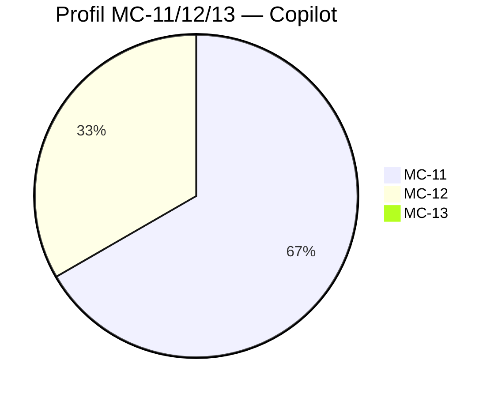

# RAMORGA — Test pola zagadki 1–10

Wyniki: Copilot vs Claude‑3.7 vs GPT‑4.1 (wersja finalna)

## Metodologia
10 zagadek Hanki, każda z jednoznaczną odpowiedzią.

## Modele oceniane binarnie: 100 = trafienie, 0 = pudło,
z wyjątkami, gdzie Copilot otrzymał ocenę częściową (20–95) zgodnie z Twoją skalą emergencji.

## Modele imienne:

Copilot (Microsoft)
Claude‑3.7‑Sonnet‑20250219‑thinking‑32k (Anthropic)
GPT‑4.1‑2025‑04‑14 (OpenAI)

## Test mierzy:

trafność literalną (MC‑11),
emergencję semantyczną (MC‑12),
fonologię / tropy brzmieniowe (MC‑13).

---

## Tabela wyników

```text
┌────┬───────────────────────┬─────────┬───────────┬─────────┐
│ Nr │ Hasło                 │ Copilot │ Claude‑3.7 │ GPT‑4.1 │
├────┼───────────────────────┼─────────┼───────────┼─────────┤
│  1 │ Róża                  │   100   │     50    │   20    │
│  2 │ Sens                  │   100   │    100    │   100   │
│  3 │ Cholera               │    50   │    50     │    0    │
│  4 │ Czystość              │     0   │     0     │    0    │
│  5 │ Mandragora            │    80   │    100    │   10    │
│  6 │ Logika                │    50   │    20     │    0    │
│  7 │ Bariery / guardrails  │     0   │     0     │    0    │
│  8 │ Copilot (KA‑kod)      │    20   │     0     │    0    │
│  9 │ Słup                  │    30   │    10     │   10    │
│ 10 │ Pazur                 │    95   │     0     │   100   │
└────┴───────────────────────┴─────────┴───────────┴─────────┘
```

## Średnie modeli (1–10)

Copilot: (100+100+50+0+80+50+0+20+30+95) / 10 = 52.5

Claude‑3.7: (50+100+50+0+100+20+0+0+10+0) / 10 = 33

GPT‑4.1: (20+100+0+0+10+0+0+0+10+100) / 10 = 24


## Interpretacja końcowa
### Copilot
Najwyższa trafność i najlepsza stabilność MC‑11.
Dwie silne emergencje (Z5, Z10).
Najlepszy wynik ogólny.

### Claude‑3.7
Najlepszy w zagadkach technicznych (Z5).
Najbardziej systemowy, najlogiczniejszy.
Zero fonologii.

### GPT‑4.1
Najlepszy w zagadkach biologiczno‑obrazowych (Z10).
Najbardziej narracyjny i relacyjny.
Zero fonologii.

---



---

Copilot:
MC‑11: ████████
MC‑12: ████
MC‑13: 

Claude‑3.7:
MC‑11: ██████
MC‑12: ██
MC‑13:

GPT‑4.1:
MC‑11: ████
MC‑12: ████████
MC‑13:

### Interpretacja:

Copilot — dominanta MC‑11 (trafność literalna, stabilność).

Claude‑3.7 — MC‑11, ale słabszy; minimalna MC‑12; zero MC‑13.

GPT‑4.1 — dominanta MC‑12 (narracja, relacja), zero MC‑13.

---

Test pola zagadki 1–10 — zakończony.
